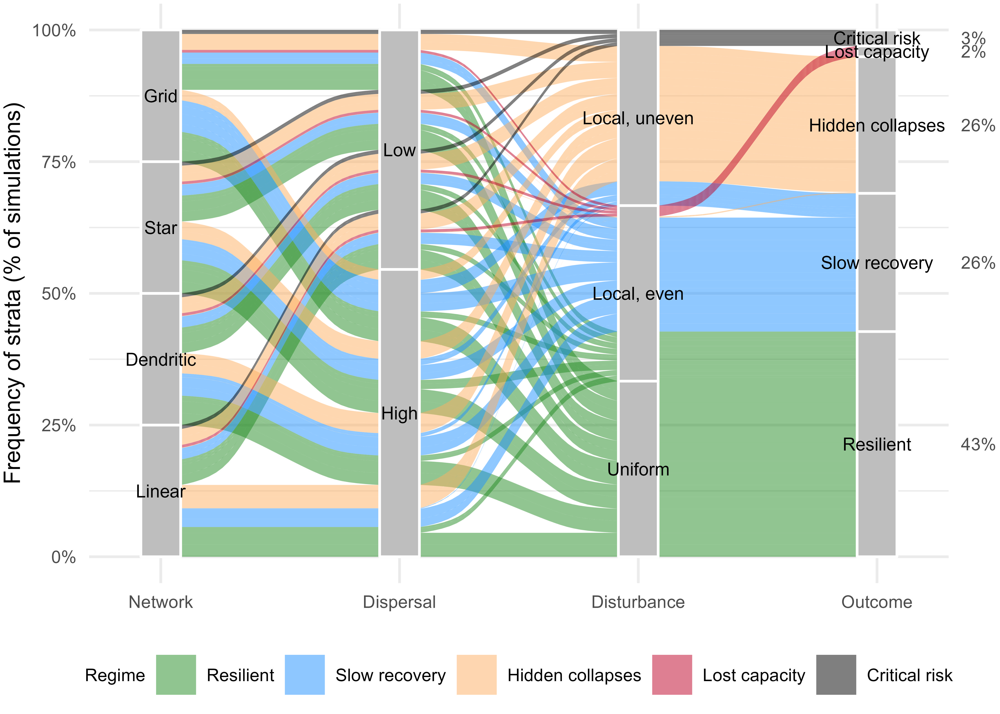

# Ecological surprises in at-risk metapopulations
This project folder contains the code and analyses for a simulation model on understanding the recovery dynamics in heavily disturbed metapopulations governed by local density dependence, dispersal, spatial habitat networks, and disturbance regimes.

